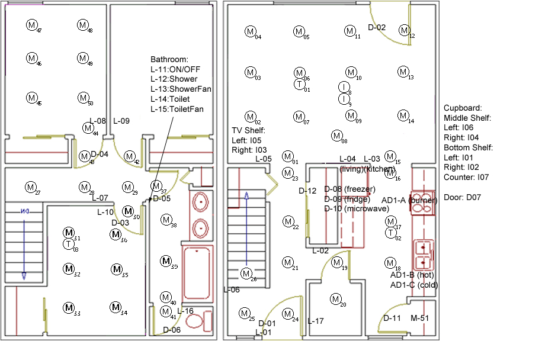
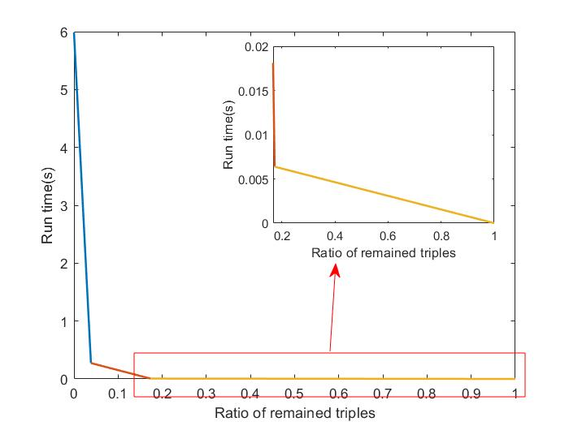

# Semantic-Compression
Matlab semantic compression code implement based on [[1]](https://ieeexplore.ieee.org/document/10032275) and[[2]](https://ieeexplore.ieee.org/document/10333452/?arnumber=10333452).

The expression of shared probability graph and semantic triples are as described in [2].


To perform semantic compression, call the function as:
```
[send,omit,conditions]=semantic_compression(G,G_shared);
[send,omit,conditions]=semantic_compression(G,G_shared,paint);
[send,omit,conditions]=semantic_compression(G,G_shared,paint,max_round);
```
### Input parameters:
- `G`: Semantic triples to be compressed. It should be a $N \times 3$ cell, where $N$ implies the number of semantic triples. The first column of `G` represents the head entity, the last is the tail entity, and the second column is the relation between them. The entities and relationships should be `string` variables.
- `G_shared`: Shared probability graph. It should be a $K\times 3$ cell ($K$ implies the number of entity pairs). The first column and the last column represent the head and tail entity, respectively. The second column of `G_shared` is a $R\times 2$ cell (denote as `r` for convenience), where $R$ is the number of relationships between given head and tail entities.
The first column of `r` is the name of relationship (string), and the second column is an array containing the samples where the relationship is established.
And example of `G_shared` and `G` is given in the example file.
- (Optional) `paint`: Whether to show the computation load figure or not. Input any non-zero value to show the figure. It is worth noting that triples that can't be omitted in the final round still take computation time, so the actual run time will be longer than that demonstrated in the output figure.
Default value: 0 (disable).
- (Optional) `max_round`: The maximum round of semantic compression. The program will stop when the current semantic compression round arrives the input value (should be bigger than 1), or no more semantic triples can be omitted. 
Default: +inf. The program stops automatically when no more semantic triples can be omitted.
### Output parameters:
- `send`: Semantic triples that needs to be sent. Same format as input `G`.
- `omit`: Semantic triples whose relations are omitted. It will be a $M \times 1$ cell and $M$ is the number of rounds occurs during compression.
The $m$-th cell contains the triples whose relations are omitted in the $m$-th round.
- `conditions`: Corresponding conditions when omitting semantic triples. It is an $(M-1)\times 1$ cell, as the first round of compression won't produce any conditions. The $m$-th cell contains conditions of the $m+1$ round. For example, condition $[a,b]$ in the third round, represents that the corresponding relation has the maximum occurrence probability in the probability matrix made by the $a$-th triple omitted in the first round, and the $b$-th triple omitted in the second round.

### Test example
#### Test environment
- System: Windows 11
- CPU: Intel(R) Core(TM) i7-10750H CPU @ 2.60GHz(12CPUs), ~2.6GHz
#### Data generation
The semantic triples and shared probability graph are extracted from the dataset provided by [WSU Smart Apartment, Two Testbeds](https://casas.wsu.edu/datasets/). Details of the dataset can be found in [[3]](https://eecs.wsu.edu/~cook/pubs/th09.pdf). The data is generated from a test house, where 2 residents live inside. The sensor layout is shown as follows.


We define the relationship of sensors and person as 'on' (triggered) and 'off' (not triggered), and sample from the data according to specific time range, with the record occurring in one minute (for example, all records occurring in 19:20 6/30)  as one sample. If a sensor is triggered by a person, the relationship between this sensor and the person will be 'on' in one sample, while the relationship between the other sensors and this person will be 'off', until we read another records, where any sensors have the relation 'off' between this person are triggered by this person, belonging to the current sample. In one sample, the relation between specific sensor and person is unique (either 'on' or 'off').

#### Experiment setting

The shared probability graph is generated from the data file [2008-06-29-BB-Formatted.txt](./2008-06-29-BB-Formatted.txt), and the sample time range is [17:20-18:00) (excluding 18:00).

Semantic triples to be compressed (`G`) is generated from [2008-06-30-BB-Formatted.txt](./2008-06-30-BB-Formatted.txt). We choose the sensor triggering condition of 17:38 as the sent data. All sensors are included. For example, if 'M01' is triggered by person 0 but not 1, triples ('M01' ' on' '0') and ('M01' 'off' '1') will both be included.

The experiment data `G` and `G_shared` is provided in the sample mat file.

#### Experiment result


### Reference
[1] Z. Yang, M. Chen, Z. Zhang and C. Huang, "Energy Efficient Semantic Communication Over Wireless Networks With Rate Splitting," in IEEE Journal on Selected Areas in Communications, vol. 41, no. 5, pp. 1484-1495, May 2023, doi: 10.1109/JSAC.2023.3240713.

[2] Z. Zhao, Z. Yang, Q. -V. Pham, Q. Yang and Z. Zhang, "Semantic Communication with Probability Graph: A Joint Communication and Computation Design," 2023 IEEE 98th Vehicular Technology Conference (VTC2023-Fall), Hong Kong, Hong Kong, 2023, pp. 1-5, doi: 10.1109/VTC2023-Fall60731.2023.10333452.

[3] S. Szewcyzk, K. Dwan, B. Minor, B. Swedlove, and D. Cook, Annotating smart environment sensor data for activity learning. Technology and Health Care, special issue on Smart Environments: Technology to support  health care, 2009.


